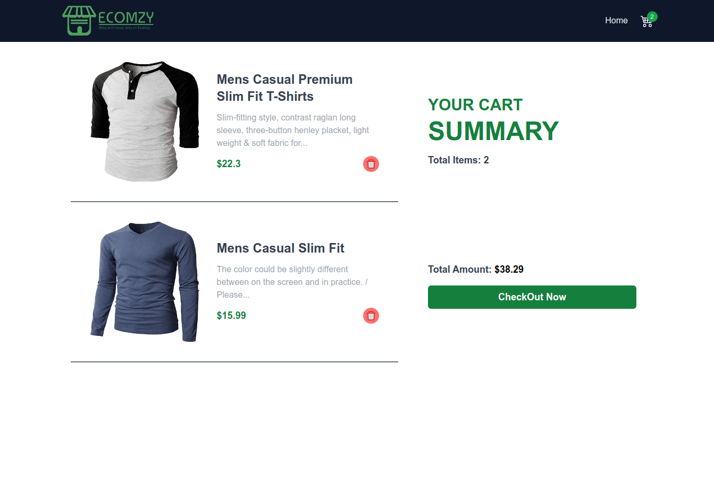

# ECOMZY Shopping App

## Description

This is a Shopping App with mainly two pages, Home and Cart.
The home page displays all the items available to be purchased and the user can checkout all the
items selected to be purchased in the cart page.

## How to set-up the project locally

    1. First clone the repository to the local.

        ```bash
        git clone https://github.com/Sahil2k07/Ecomzy-Shopping-App.git
        ```

    2. Install all the dependencies by running the following command.

        ```bash
        cd Ecomzy-Shopping-App
        ```

        ```bash
        npm install
        ```

    3. Initialize the project.

        ```bash
        npm run dev
        ```

## Home Page


## Cart Page



## Technologies Used

- HTML
- CSS
- Javascript
- Tailwind CSS (CSS Framework)
- React (JS Library)
- Vite (Bundler)
- React-Router-Dom
- React-Redux-Toolkit
